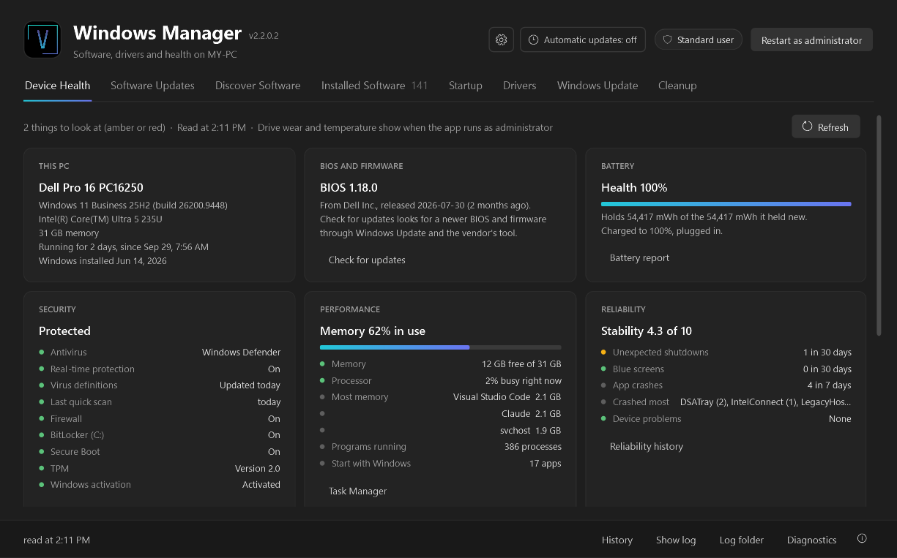
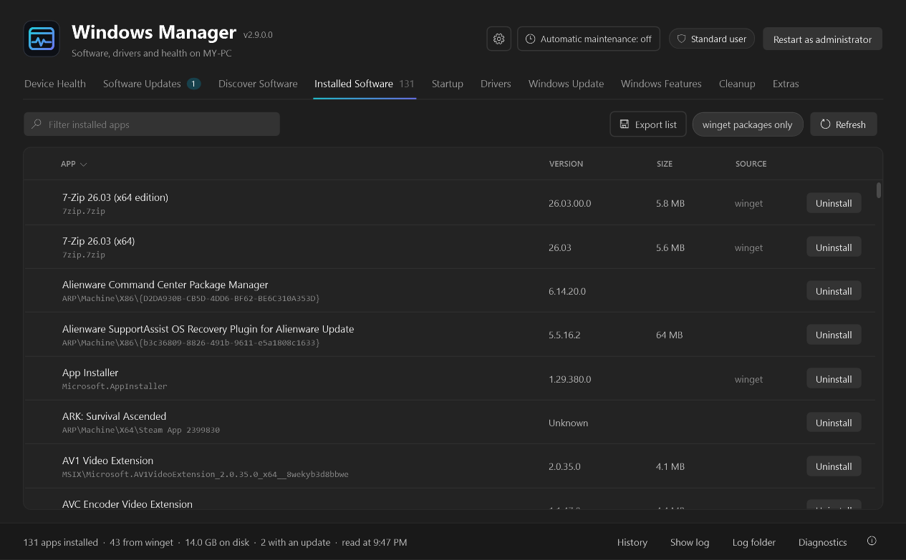
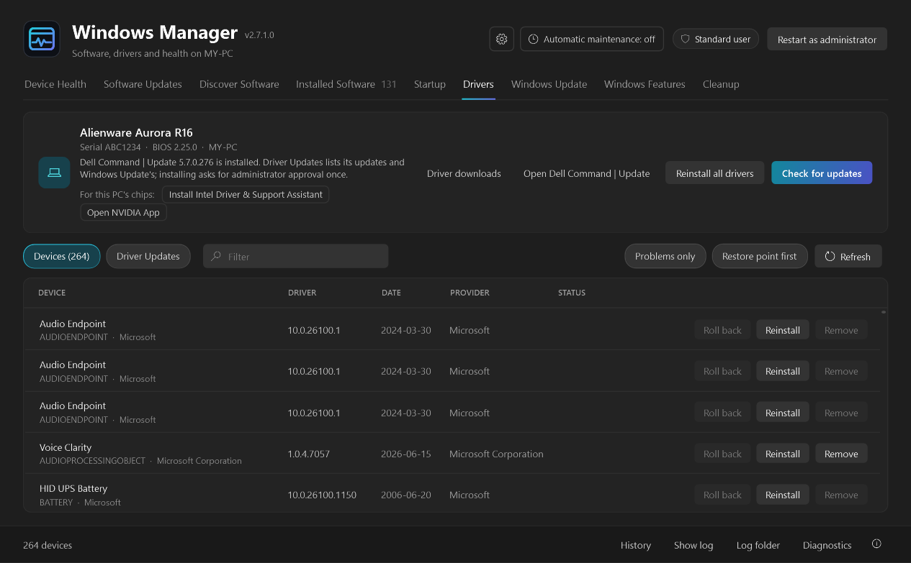
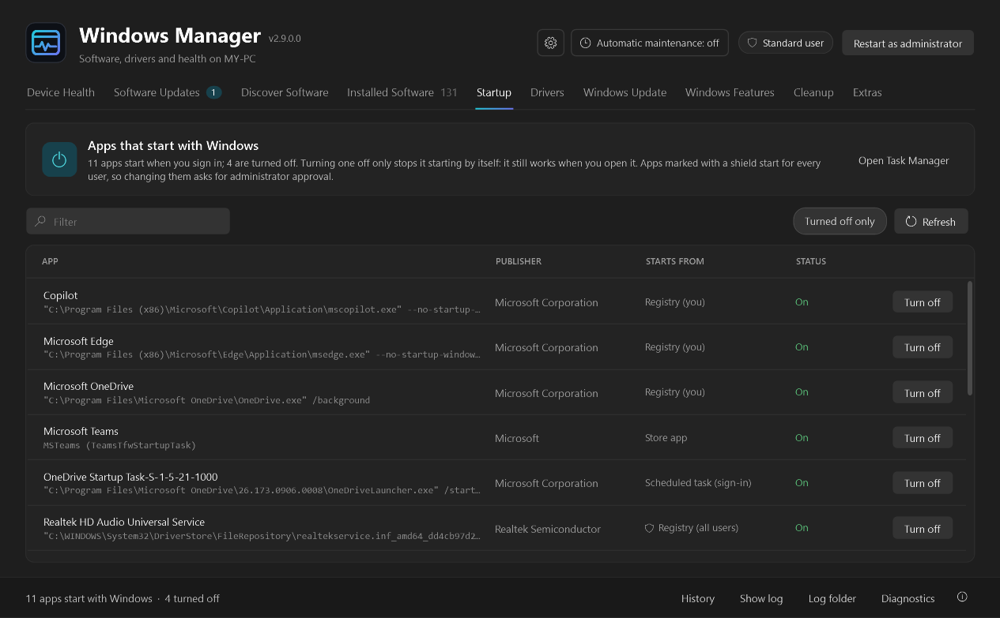
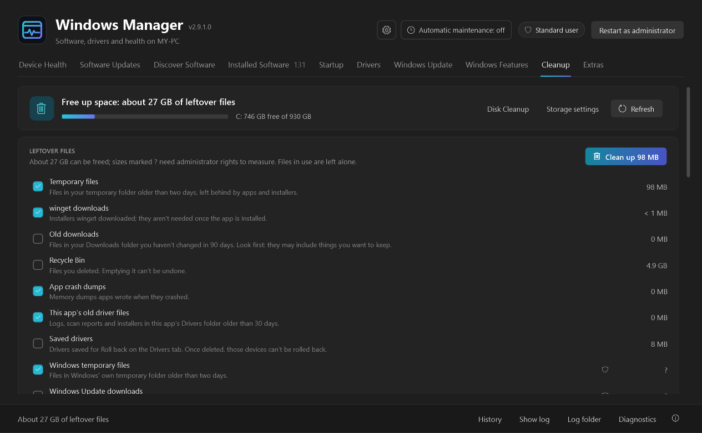

# Windows Manager

A single-exe Windows app for keeping a PC's software current. Through winget, Microsoft's command-line package
manager, it keeps apps updated (on demand or on a schedule), finds and installs new apps, and uninstalls what you no
longer need. It also turns startup apps on and off, installs Windows' own updates, keeps drivers current (from Windows
Update, the PC's vendor, NVIDIA and AMD, with a saved copy to roll back to), removes built-in apps and turns Windows'
optional features on and off, shows the PC's health (with trends over time, alerts and a shareable report), and cleans
up leftover files, including what uninstalled apps leave behind. A setup backup puts your apps and options on a new PC.

## Screenshots

**Device Health**, where the app opens: security, performance, reliability, updates, network, battery and drives at a
glance.



**Installed Software**, sorted by size, with uninstall on every row.



**Drivers**: the PC's vendor tool, and driver updates from Windows Update, the vendor, NVIDIA and AMD.



**Startup**: apps that start when you sign in, turned on or off the way Task Manager does it.



**Cleanup**: leftover files measured and cleaned, plus large files and the biggest apps.



## Using it

Download `Windows Manager.exe` from the [latest release](https://github.com/jdvieira/WindowsManager/releases/latest)
and run it; there is nothing to install. (To build it yourself, see [Building](#building); it lands in
`dist\Windows Manager.exe`.) There are nine sections, as tabs under the header (Ctrl+1 to Ctrl+9): Device
Health (where the app opens), Software Updates, Discover Software, Installed Software, Startup, Drivers, Windows
Update, Windows Features and Cleanup. One copy of the app runs at a time: opening it again brings the open window to
the front.

### Device Health

The tab the app opens on: how the PC is doing, at a glance. The line at the top says how many things need a look;
each card's lines have a green, amber, red or grey dot.

| Card | What it shows |
| --- | --- |
| This PC | Model, Windows version and build, processor, memory, how long since the last restart (and a note when a restart is waiting, or it's been two weeks), when Windows was installed |
| BIOS and firmware | BIOS version and release date, and whether the last driver check found a newer one. **Check for updates** runs the Drivers tab's check |
| Battery | Health (what it holds now against what it held new, from Windows' battery report), charge cycles, and the charge right now. **Battery report** opens Windows' full report |
| Security | Antivirus (whichever Windows Security Center reports), real-time protection, how old the virus definitions and the last quick scan are, the firewall, BitLocker on the system drive, Secure Boot, the TPM, and Windows activation. **Windows Security** opens it |
| Performance | Memory in use (with a bar), how busy the processor is right now, the three apps using the most memory, how many programs are running and how many start with Windows. **Task Manager** opens it |
| Reliability | Windows' stability index, unexpected shutdowns and blue screens in the last 30 days, app crashes in the last 7 (and which apps), and devices with a problem. **Reliability history** opens Windows' Reliability Monitor |
| Updates | What's waiting from winget (Software Updates), Windows Update and the drivers check, and a waiting restart. **See updates** opens the tab with them |
| Network | Each connected adapter, the network (and Wi-Fi signal), link speed and address, and whether there's internet access |
| Cleanup | How much the Cleanup tab can free, and the system drive's free space. **Open Cleanup** goes there |
| Drives | Each drive's free space (amber under 20% free, red under 10%), and each disk's health. Wear and temperature show when the app runs as administrator |
| Trends | Battery health, free space on the system drive, the stability index, app crashes, memory in use and drive wear over the last 90 days, each as a small line with its latest value and the change since the first reading (hover a point for its date and value). One reading a day is kept, from the tab and from automatic runs, for 400 days in `health-history.jsonl`; the card appears once there are two days |

**Save report** writes the whole page as one HTML file on the desktop and opens it: every card, the drives, waiting
updates, startup apps and installed software, to keep or send to someone helping with the PC.

Automatic runs also check the PC's health (Options > Automatic runs > **Check the PC's health and tell me about problems**, on by
default) and send a Windows notification when something needs attention: antivirus or real-time protection off, old
virus definitions, a firewall off, a drive under 10% free, a disk reporting a problem, a battery under 60% of its
original capacity, blue screens, or a restart that has been waiting for days. Each problem is mentioned once, and
again after a week if it's still there.

### Software Updates

The app checks for updates as soon as it opens. The tab shows how many are waiting.

| Action | How |
| --- | --- |
| Update one app | **Update** on its row, or right-click > Update |
| Update several | Tick them, then **Update selected** |
| Update everything | **Update all** (skips hidden apps and apps tagged *explicit*) |
| See what changed | **What's new** under the new version (when winget has release notes): hover for a preview, click for all of it and a link to the publisher's page |
| Hide an update (keep the app at its version) | Right-click > Hide (keep at this version). The update leaves the list, and nothing updates the app: not Update all, not automatic updates, and not winget itself (the app sets a winget pin). Right-click > Unhide (allow updates again) undoes it |
| See hidden updates | **Show hidden** in the toolbar (appears when something is hidden). Hidden rows are dimmed, tagged *hidden*, and their button reads Hidden |
| Apps Windows updates itself | Edge, WebView2, Teams and Microsoft 365 keep themselves up to date, and winget's update of them often fails ("the install technology is different"). They are tagged *updated by Windows*, kept off the list like hidden apps, and skipped by Update all and automatic updates. Apps whose update fails that way are added automatically. Right-click > Let winget update it to change that for one app; Options > Packages lists them |
| Watch an installer | Right-click > Update interactively |
| Check again | **Refresh** or F5 |

### Discover Software

A starter list of about 50 popular apps (browsers, developer tools, media, communication, utilities), each tagged with
its category and marked if it is already installed. Microsoft Store apps carry a *Store* tag.

| Action | How |
| --- | --- |
| Search all of winget | Type a name and press Enter (or **Search winget**). Esc goes back to the starter list |
| Narrow what is shown | Keep typing; the list filters as you type |
| Install one app | **Install** on its row |
| Install several | Tick them, then **Install selected** |
| Install for all users | Right-click > Install for all users (usually asks for administrator approval) |
| Install an older (or any) version | Right-click > Install a specific version. Pick one from winget's list; **Keep this version** (on by default) hides the app once it installs, so it stays at that version |
| Install your apps on a new PC | **Import list** opens a list saved with Export list or a setup backup (or by `winget export`, or a text file with one package ID per line). Apps not on this PC come pre-selected, so **Install selected** installs the rest; a setup backup then offers its options too. Esc goes back to the starter list |
| See an installer | Right-click > Install interactively |
| See what an app is | Descriptions fill in on their own a few seconds after the list appears (8 lookups at a time); they are remembered, so next time they show straight away |
| Read about an app | Double-click it, or right-click > Show details (description, publisher, homepage, license, release notes) |

New installs use the scope set in Options > Packages ("Installer default", "Just me" or "All users").

### Installed Software

Everything installed on the PC, including apps winget did not install. **winget packages only** hides those.

| Action | How |
| --- | --- |
| Uninstall | **Uninstall** on its row. The app asks you to confirm first |
| Remove what it left behind | After an uninstall, the app looks for what the app left: folders named after it (or its publisher's folder) in AppData, ProgramData and Program Files, its scheduled tasks, and startup entries whose program is gone. If it finds any, it lists them, all ticked: **Remove ticked** sends folders to the Recycle Bin (so a wrong guess can be brought back) and deletes the rest. Folders a running program uses are left out; items outside your profile need one administrator approval |
| See what takes space | The **Size** column (click it to sort, largest first) and the total in the status bar. Sizes come from what each app reports to Windows; Store apps are measured from their install folders in the background and remembered in `sizes.json`. Apps that report nothing (Office language packs, for example) show no size |
| Save your app list | **Export list**: choose the apps (all winget and Store apps are ticked), then save. The file is in winget's own export format, so `winget import` reads it too |
| Keep an app at its version | Right-click > Hide (keep at this version), the same as on Updates; hidden apps are tagged *hidden* here too. Apps with an update waiting carry an *update* tag |
| Watch the uninstaller | Right-click > Uninstall interactively |
| Read again | **Refresh** or F5 (the list is also re-read after an install from Discover) |

Some packages, such as WindowsAppRuntime, are installed more than once (one copy per architecture or version). Each
copy has its own row, and uninstalling one removes only that version.

### Drivers

The PC's vendor, model, serial number and BIOS; the vendor's driver tool; tools for its chips; driver updates; and
every device with its driver. It works on any PC: laptops and desktops from the vendors below, and home-built PCs
(recognised by their motherboard).

| Action | How |
| --- | --- |
| See driver updates | **Driver Updates** (the default view) checks Windows Update when the tab opens, with no approval needed: certified drivers and firmware from every vendor. On a Dell or Alienware, **Check for updates** adds Dell Command \| Update's BIOS, firmware, driver and app updates |
| Install them | Tick the Windows Update drivers you want (all are ticked), and pick Dell's by type with the chips (BIOS is off by default), then **Install N updates**. Everything installs in one run, with one administrator approval; restarts are left to you. The drivers that Windows Update and NVIDIA replace are saved first, for Roll back |
| Get the vendor's tool | Offered as soon as the tab opens when it isn't installed, and always on the header button. winget installs it (from winget or the Microsoft Store); tools winget doesn't have get a **Get** button that opens the vendor's download page |
| Update NVIDIA graphics | On a PC with NVIDIA graphics, Driver Updates also asks NVIDIA for the newest Game Ready driver for the card (the lookup NVIDIA's driver download page uses) and lists it when it's newer than the installed one. Installing downloads NVIDIA's package, checks it is signed by NVIDIA, runs it silently without a restart, and reads the driver version back. The NVIDIA App itself has no way to be driven from outside, so this goes straight to NVIDIA |
| Update AMD graphics | On a PC with AMD Radeon graphics, Driver Updates reads the newest recommended Adrenalin version from AMD's driver page and lists it when it's newer. **Get installer** downloads AMD's auto-detect installer, checks AMD's signature and opens it; it installs in its own window, since AMD doesn't document a silent install |
| Get tools for the chips | **For this PC's chips**: Intel Driver & Support Assistant, NVIDIA App, or AMD Software, depending on the processor and graphics |
| Open the vendor's download page | **Driver downloads** (Dell's opens straight on this PC's service tag) |
| Reinstall every driver | **Reinstall all drivers** (Dell's driver restore, `dcu-cli /driverInstall`) |
| Reinstall one device's driver | Devices > **Reinstall**: Windows removes the device and finds it again (`pnputil /remove-device`, then `/scan-devices`) |
| Remove a driver | Devices > **Remove**, for third-party drivers (`oem*.inf`): `pnputil /delete-driver /uninstall`. The device falls back to another driver |
| Go back to an earlier driver | Devices > **Roll back**, once a driver has been saved for the device. Before this app removes, reinstalls or replaces a third-party driver, it saves the current one (`pnputil /export-driver`) in `%LOCALAPPDATA%\WindowsManager\DriverBackups`. Roll back forces the saved driver back onto the device, after saving the current one, so you can go forward again. The newest two per device are kept |
| Find a device | Filter box; **Problems only** shows devices Windows reports a problem for (they are listed first anyway) |

Vendor tools the tab knows:

| Vendor | Tool | Installed from |
| --- | --- | --- |
| Dell, Alienware | Dell Command \| Update (driven from the tab) | winget |
| HP business (EliteBook, ProBook, ZBook, Elite, ProDesk...) | HP Image Assistant | winget |
| HP home (OMEN, Victus, Pavilion, ENVY, Spectre...) | HP Support Assistant | HP's site |
| Lenovo Think (ThinkPad, ThinkCentre, ThinkBook...) | Lenovo System Update | winget |
| Lenovo home (IdeaPad, Legion, Yoga, LOQ...) | Lenovo Vantage | Microsoft Store |
| ASUS | MyASUS | Microsoft Store |
| MSI | MSI Center | Microsoft Store |
| Samsung | Samsung Update | Microsoft Store |
| Microsoft Surface | Surface (drivers come through Windows Update) | winget |
| Razer | Razer Synapse | winget |
| Dynabook, Toshiba | dynabook Support Utility | Microsoft Store |
| Acer, Gigabyte | Acer Care Center, GIGABYTE Control Center | vendor's site |
| ASRock, Framework | (driver downloads page only) | |

- **Work PCs**: when an organization manages driver updates (Windows Update for Business through Intune, an update
  server, or a policy that keeps drivers out of Windows Update), Settings only shows the drivers IT has approved, while
  this tab lists every driver Windows Update has for the hardware. A note says so, and those drivers start unticked,
  since installing one here goes around the approval.
- Dell Command \| Update sometimes answers from its saved results instead of checking Dell again; the tab says when.
  Only one Dell Command \| Update can work at a time, so the tab won't start a check while another one (or Dell's own
  window) is busy, and a run that makes no progress for 5 minutes shows a **Stop waiting** button.
- Intel Driver & Support Assistant has no command line either; Intel's drivers mostly reach Driver Updates through
  Windows Update (and, on Dell PCs, Dell Command \| Update), and **Open Intel Driver & Support Assistant** covers the rest.
- Only Dell Command \| Update is driven from the tab; the other vendors' tools are installed and opened, since they
  couldn't be tested yet. Windows Update's drivers work on every PC.
- Installing (and Dell Command \| Update's check) needs administrator rights: one approval per run, unless the app
  runs as administrator. **Restore point first** (on by default, and remembered) creates a restore point before any
  change, even when Windows made one earlier that day. Scans don't make one. If System Protection is off, the log says so.
- Every change goes into History. Each administrator step is saved as a script with its own log (plus Dell's report
  and logs) in `%LOCALAPPDATA%\WindowsManager\Drivers`. When something fails, the message says why, and those
  files show every step, including who it ran as and each tool's own output.
### Startup

Apps that start when you sign in, as Task Manager lists them: the Run keys (yours, and every user's), the Startup
folders, and Store apps' startup tasks; plus scheduled tasks that start at sign-in or at startup (outside Windows' own
`\Microsoft` folder), which Task Manager doesn't show. Each shows its name, the command it runs, its publisher and
where it starts from.

| Action | How |
| --- | --- |
| Stop an app starting by itself | **Turn off** on its row (or right-click). It still works when you open it; nothing is deleted. Task Manager and Settings > Apps > Startup show the same change, because the app uses their switch (the `StartupApproved` values, or a Store app's startup task state) |
| Let it start again | **Turn on** |
| Apps that start for everyone | Marked with a shield; turning them on or off asks for administrator approval |
| Scheduled tasks | **Turn off** disables the task (Task Scheduler shows it as Disabled); **Turn on** enables it again. Tasks that run as another account need administrator approval |
| See only what's off | **Turned off only** |
| Find the program | Right-click > Open file location, or Copy command |
| Startup impact | **Open Task Manager** (its Startup apps page measures how much each one slows sign-in) |

### Windows Update

Windows' own updates for the PC: security and cumulative updates, .NET, Defender definitions, and other Microsoft
products when Microsoft Update is on. Drivers stay on the Drivers tab. The check needs no approval; the tab shows how
many updates are waiting.

| Action | How |
| --- | --- |
| Install updates | Tick them (all are ticked except optional ones, such as previews), then **Install N updates**. They download and install through Windows Update one at a time, in one administrator run; the log says which one is going |
| Finish with a restart | **Restart now** appears when Windows is waiting for one (it asks first, and gives 15 seconds) |
| See what installed lately | **Installed recently**: Windows Update's own history, with each result |
| Windows Update's own page | **Windows Update settings** |

On a work PC whose updates are managed (Intune, Group Policy or an update server), a note says so: installing here
installs straight away, which may be sooner than IT intended. **Restore point first** is shared with the Drivers tab.

### Windows Features

| View | What it does |
| --- | --- |
| Built-in apps | The Store apps that came with Windows (or that you added) and that Windows lets you remove: Bing News, Clipchamp, Xbox apps, Solitaire and the like, with their publisher. **Remove** removes one for your account (after asking). Removed apps stay on the list with **Reinstall**, which registers them again from their files; when Windows has cleared those, it opens the app's Microsoft Store page. Parts of Windows itself and frameworks aren't listed |
| Optional features | Windows' optional features (.NET Framework 3.5, Hyper-V, Windows Sandbox, the Linux subsystem, the TFTP and Telnet clients, and so on), each on or off. **Turn on** / **Turn off** asks for administrator approval and makes a restore point first (with **Restore point first** on); some need a restart, which the row says. History has each change |

Filter by name, and **On only** shows only what's installed or turned on.

### Cleanup

| Section | What it does |
| --- | --- |
| Drive space | The system drive's free space, and how much the leftover files take. **Disk Cleanup** and **Storage settings** open Windows' own tools |
| Leftover files | What apps, installers and Windows leave behind, measured: temporary files, winget downloads, old downloads (90 days, off by default), the Recycle Bin, crash dumps, error reports, this app's old driver files, saved drivers, Windows' temporary files, Windows Update downloads, Delivery Optimization files, Dell Command \| Update downloads, and NVIDIA's and AMD's installer folders. Tick what to delete, then **Clean up**. Files in use are left alone; items with a shield need one administrator approval |
| Large files | The 25 largest files over 100 MB in Downloads, Desktop, Documents, Videos, Pictures and Music. **Show** opens the folder; **Delete** moves the file to the Recycle Bin (after asking). Files kept only in OneDrive aren't listed, so nothing is downloaded |
| Biggest apps | The eight apps that take the most space, with **Uninstall** (which asks first). **All installed software** opens Installed Software sorted by size |

### Everywhere

- winget does one thing at a time. Installs, updates and uninstalls queue up, so you can keep adding more while one
  runs. **Stop after current app** cancels the rest of the queue.
- Search the current list with Ctrl+F. Esc clears the search.
- **History** (bottom right) lists every install, update, uninstall and hold, from the app and from automatic updates,
  newest first, with the versions and the result. Filter by app, show only automatic updates or only failures, or clear
  it. It keeps the last year (up to 2,000 entries) in `%LOCALAPPDATA%\WindowsManager\history.jsonl`.
- **Show log** shows what winget is doing. **Log folder** opens the daily log files.
- **Diagnostics** saves a zip on the desktop with this app's logs and error log, the administrator runs' scripts and
  logs (Dell Command \| Update's too), winget's logs, settings, history, the last automatic run, and a `system.txt` about
  the PC and what the app found on it. Send it to whoever is helping when something goes wrong.
- The small info button at the bottom right shows the version, who made the app, and how to get in touch.
- Right-click > Copy package ID or Copy winget command.

### Options

Click the gear in the header. Packages, Automatic runs and Logs apply when you click **Save**; Sources and Maintenance act straight away.

| Page | What's there |
| --- | --- |
| Packages | Source (all / winget / Microsoft Store), install scope for new apps, silent installs, include unknown versions, uninstall previous version, check on open, the hidden apps list (IDs added or removed here get their winget pin set or removed on Save), and the apps left to Windows, with **Forget learned apps** |
| Sources | winget's sources, each with an **In searches** switch (off = only used when a package names it) and **Remove**; **Update sources**, **Reset sources**, and **Add a source** (name, URL, REST or pre-indexed, optionally only when named). Adding, removing and switching need administrator approval |
| Automatic runs | Retry failures once, restore point first, only with network, only on AC power, random start delay, maximum run time, notification style (a Windows notification or this app's pop-up), auto-close pop-ups, and **Check the PC's health and tell me about problems** |
| App updates | The version you have and the latest one, **Check now**, **Update now**, **Go back to** the previous version, **Release notes**, and the switches for checking on open, updating without asking, and **Get beta versions** |
| Logs | Keep logs for N days (default 30), log folder, verbose winget logging, buttons to open the log folders, and **Save diagnostics** |
| Maintenance | winget version, export or import settings, open the data folder, reset to defaults, and **Back up this PC's setup** / **Set up from a backup** |

Changing an automatic-run condition re-registers the scheduled task on Save (with one UAC prompt if the task runs
elevated). Settings are stored in `%LOCALAPPDATA%\WindowsManager\settings.json`.

### Logs

One file per day in `%LOCALAPPDATA%\WindowsManager\Logs` (or the folder chosen in Options), kept for 30 days by
default. Old files are deleted when the app starts. The app's own error log (`%TEMP%\Windows_Manager.log`)
follows the same limit and is also cleared once it grows past 1 MB.

### Rights

The app runs as the signed-in user. Installs, updates and uninstalls of apps for all users ask for approval (UAC) one
by one. To approve once for the whole session, use **Restart as administrator**. Alternatively, build with
`-RequireAdmin` so the exe always starts elevated.

### What winget runs

```
winget upgrade   --id <Id> --exact --source <Source> --accept-package-agreements --accept-source-agreements
                 --disable-interactivity --include-unknown [--silent | --interactive] [--include-pinned]
winget install   --id <Id> --exact --source <Source> --accept-package-agreements --accept-source-agreements
                 --disable-interactivity [--scope user|machine] [--version <Version>] [--silent | --interactive]
winget pin add   --id <Id> --exact --blocking --force [--source <Source>]      (Hide)
winget pin remove --id <Id> --exact                                             (Unhide)
winget uninstall --id <Id> --exact [--source <Source>] [--version <Version>] --accept-source-agreements
                 --disable-interactivity [--silent | --interactive]
```

`--include-pinned` is added only for apps tagged *explicit*: apps that winget upgrades only when asked by name. The
update check itself runs `winget upgrade --include-pinned` and reads `winget pin list`, so hidden apps stay listed
(tagged *hidden*) instead of disappearing. `--version` is added to an install of a chosen version, and to an uninstall
when that package is installed more than once.

## Automatic updates

Click **Automatic updates** in the header to schedule unattended updates.

- **When**: daily or on chosen weekdays, at a time you pick (for example `3:00 AM` or `15:30`).
- **What it does**: the scheduled task *Windows Manager* runs `Windows Manager.exe -Auto` as you, while
  you are signed in (winget needs your session). It updates every listed app silently. It skips hidden apps (and any
  app pinned in winget) and apps tagged *explicit*. Automatic runs only update; they never install or uninstall.
- **What to do**: **Install updates** (the default), or **Just tell me what's available**: the run installs nothing,
  and when updates are waiting a notification lists them (with their versions) and a button to open the app. The
  header button then reads "Update check: ..." instead of "Automatic: ...".
- **Notifications**: nothing appears unless an update fails or the check fails. Then a Windows notification says what
  happened (it stays in the notification center), with **Open Windows Manager** and **View log** buttons. You
  can also turn on notifications for restarts, or a summary after every run that installs something. When Windows
  notifications are off for the app, or Options > Automatic runs picks *This app's pop-up*, the app's own pop-up lists
  every app's result instead. The app registers its name and icon for notifications, and a `windowsmanager:`
  link for the buttons, under your user account.
- **Run elevated** (on by default): the task runs with your highest privileges, so installers never stop to ask for
  approval. Saving this needs administrator approval once.
- **Run as soon as possible after a missed start**: if the PC was off or asleep, the task runs when it is next available.
- **Run now** starts the task immediately. **Test notification** runs `-Auto -DryRun`: a real check that shows the
  notification with what would be updated, and installs nothing.
- Each automatic run is logged in the daily log, and every update it installs (or fails to) goes into History. Its result goes to `%LOCALAPPDATA%\WindowsManager\lastrun.json`,
  which the panel shows as "Last run".

The task points at the exe's current location. If you move the exe, open the panel and **Save** again (the panel
warns you when the task points somewhere else). Turning **Update apps automatically** off and saving deletes the task.

## Keeping Windows Manager up to date

Each time it opens, the app reads the latest release on GitHub
([jdvieira/WindowsManager](https://github.com/jdvieira/WindowsManager/releases)) in the background. When that release
is newer, it shows what's new and offers **Update now**:

- It downloads the release's exe, checks it against the SHA-256 checksum GitHub publishes and against its own version
  number, then swaps it in: the running exe is renamed to `Windows Manager.exe.old`, the new one takes its name (so
  the scheduled task and any shortcuts still point at it), and the new version starts. The old copy waits, out of
  sight, until the new one has opened its window. If the new one closes straight away or doesn't open within 90
  seconds, everything is put back, the old version carries on, and the failed version isn't offered again on start.
- Once open, the new version keeps the old exe in `%LOCALAPPDATA%\WindowsManager\Previous` (one version) and adds the
  update to History. Options > App updates > **Go back to <version>** switches back to it the same way (with the same
  safety net); the newer version is kept too, so you can come back to it. Versions before 2.3 can't do this, so going
  back to one of them means updating again from GitHub to return.
- **Not now** skips that version; it isn't offered again on start, but Options > App updates can still install it.
- It waits when something is installing, updating or running as administrator, and offers the update next time.
- A copy run from its source files can't replace itself, so it points to the release page instead (use `git pull`).

Options > **App updates** shows the version you have and the latest one, with **Check now**, **Update now** and
**Release notes**, and three switches: **Check for a new version when the app opens** (on by default), **Update
without asking** (off by default: it then downloads, swaps and restarts by itself), and **Get beta versions** (off by
default: pre-releases are offered too, as soon as they're published).

Publishing a release the updater picks up: tag it `v<version>` (the same as `$AppVersion`, for example `v2.2.0.0`) and
attach the built `Windows Manager.exe` with the label "Windows Manager.exe" (`gh release create v<version>
"dist\Windows Manager.exe#Windows Manager.exe"`): GitHub turns the space in the file name into a dot, and the label is
what its release page shows. Any `.exe` asset works for the updater. The
newest release that isn't a draft or pre-release is the one offered (with **Get beta versions**, the newest of all).

Pushing the tag does the same on GitHub (`.github\workflows\release.yml`): it builds the exe from the tagged commit,
checks it's the tag's version, and creates the release with that version's `CHANGELOG.md` section as the notes. A tag
with a hyphen, such as `v2.4.0.0-beta1`, becomes a pre-release, which only copies on beta versions are offered. It
does nothing when the release was already created by hand.

## Setting up a new PC

Options > Maintenance > **Back up this PC's setup** saves one file with the apps you choose (in winget's export format,
so `winget import` reads it too), plus your hidden apps, options and automatic update schedule. It goes to OneDrive
(`Windows Manager` folder) when OneDrive is set up, so it's there on the next PC.

On the new PC, run the app and choose **Set up from a backup** (or **Import list** on Discover). Discover lists the
backup's apps with the missing ones ticked: click **Install selected**. Then Options opens with the backup's options
and schedule filled in; review them and click **Save**.

### Moving from a development build

Version 2.0 was called Windows Software Manager; before its 1.0 release the app was called Windows Package Manager
(and, earlier, Winget Manager, Winget Package Manager and Winget Update Manager). On first start it moves settings,
logs, history, saved descriptions and sizes, driver backups and the hidden list from the folder one of those used
(`%LOCALAPPDATA%\WindowsSoftwareManager`, `WindowsPackageManager`, `WingetManager`, `WingetPackageManager` or
`WingetUpdateManager`). If a scheduled task still has one of those names, the app offers to move it to *Windows
Manager* with the same schedule, pointing at the new exe (the header button reads "Automatic updates: move needed"
until you do). It also replaces the old name's notification registration with its own.

## Files

| File | Purpose |
| --- | --- |
| `src\*.ps1` | The app's code, in parts that join in name order: `00-Startup` (parameters, version, one copy at a time), settings, scheduled task, data classes, the background worker and its 2.0 operations, health history and alerts (`28-HealthHistory`), the window's layout, notifications, automatic runs, then one part per tab or panel (`78-Leftovers`, `80-Drivers`, `81-DriverBackup`, `82-Amd`, `83-WindowsUpdate`, `84-Startup`, `86-Health`, `87-HealthCards`, `88-Setup`, `89-Diagnostics`, `91-WinFeatures`, `92-Cleanup`, `93-AppUpdate`, ...), wiring, and `95-Main` |
| `Windows_Manager.ps1` | Runs the app from source: joins `src\*.ps1` into `dist\build\Windows_Manager.dev.ps1` and runs that, with the same arguments, exactly as the exe runs |
| `Build-Exe.ps1` | Joins the same parts, embeds the assets, and compiles `dist\Windows Manager.exe` with PS2EXE |
| `tools\Test-Source.ps1` | Checks the source as the build reads it (ASCII only, parses, no test driver left), and with `-SelfTest` runs the self-test |
| `tools\Get-ReleaseNotes.ps1` | Prints one version's `CHANGELOG.md` section (the release notes) |
| `tools\New-WingetManifest.ps1` | Writes the winget manifest for a published release |
| `.github\workflows\` | `ci.yml` checks and builds every pull request (the exe is attached to the run); `release.yml` publishes a release when a version tag is pushed |
| `CHANGELOG.md` | Every change, by version |
| `TESTING.md` | What to try on real PCs, for the parts that need administrator approval or particular hardware |
| `%LOCALAPPDATA%\WindowsManager\` | settings.json, lastrun.json, descriptions.json, sizes.json, history.jsonl, health-history.jsonl (a reading a day), health-alerts.json (what was mentioned when), removed-apps.json (built-in apps to offer back), notification.png, Logs\, Drivers\ (administrator runs' scripts and logs), DriverBackups\, Previous\ (the version before the last update) |
| `assets\icon.ico` | App and exe icon (embedded in the exe by the build) |
| `assets\logo.jpg` | Header logo (embedded in the exe by the build) |

## Building

Requirements: Windows PowerShell 5.1 and the ps2exe module (`Install-Module ps2exe -Scope CurrentUser`).

```powershell
.\Build-Exe.ps1                                   # standard exe
.\Build-Exe.ps1 -RequireAdmin                     # always starts elevated
.\Build-Exe.ps1 -CertificateThumbprint <thumb>    # signed (recommended: EDR often flags unsigned PS2EXE exes)
```

For every change, bump `$AppVersion` in `src\00-Startup.ps1`, add a `CHANGELOG.md` entry, and rebuild. Keep the code
ASCII-only (the build refuses anything else, since Windows PowerShell 5.1 reads files without a BOM as ANSI). A new part
goes in `src\` with a number that puts it in the right place; a new tab registers itself in `$Panels` (see
`40-State.ps1`).

Before a pull request, run `.\tools\Test-Source.ps1 -SelfTest`. GitHub runs the same checks on every pull request and
attaches the built exe to the run, so it can be tried before merging.

### Publishing to winget

Once a release is on GitHub, `.\tools\New-WingetManifest.ps1 -Version <version>` writes its manifest (package
`jdvieira.WindowsManager`, a portable app with a `windows-manager` command) under `dist\winget`, with the checksum
GitHub gives for the release's exe. Check it with `winget validate --manifest <folder>`, try it with
`winget install --manifest <folder>`, then open a pull request to
[microsoft/winget-pkgs](https://github.com/microsoft/winget-pkgs) with the folder (`manifests\j\jdvieira\WindowsManager\<version>`).

## Testing without the window

```powershell
powershell -STA -File .\Windows_Manager.ps1 -SelfTest                          # checks updates, reads the installed list, prints both
powershell -STA -File .\Windows_Manager.ps1 -SelfTest -Screenshot .\ui.png     # also renders every section, details, panels and Options pages
powershell -STA -File .\Windows_Manager.ps1 -Auto -DryRun                      # unattended check, notification only
```

Line numbers in errors refer to `dist\build\Windows_Manager.dev.ps1`, where each part starts with a
`# ==== src\<part>.ps1` line. `TESTING.md` lists what to try by hand on real PCs.

## Troubleshooting

- **"winget is not installed"**: install or update *App Installer* from the Microsoft Store (the app has a button for this).
- **An install, update or uninstall fails**: the status shows winget's reason. Right-click > the "interactively"
  option shows the installer itself. The full output is in the log.
- **"winget shortened this ID"**: winget cut off a very long package ID in its output, so the app can't act on it.
  Use winget directly, or Settings > Apps for uninstalls.
- **The app itself errors**: details are written to `%TEMP%\Windows_Manager.log`.
- **Running as SYSTEM** (for example from an RMM tool) is not supported. winget needs a user session.

## Author

Justin Vieira, [jdvieira@icloud.com](mailto:jdvieira@icloud.com)
